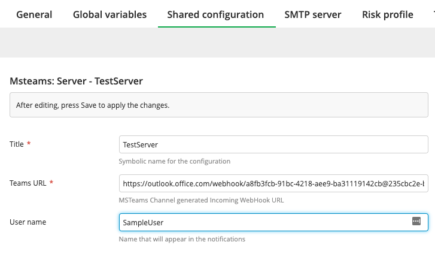
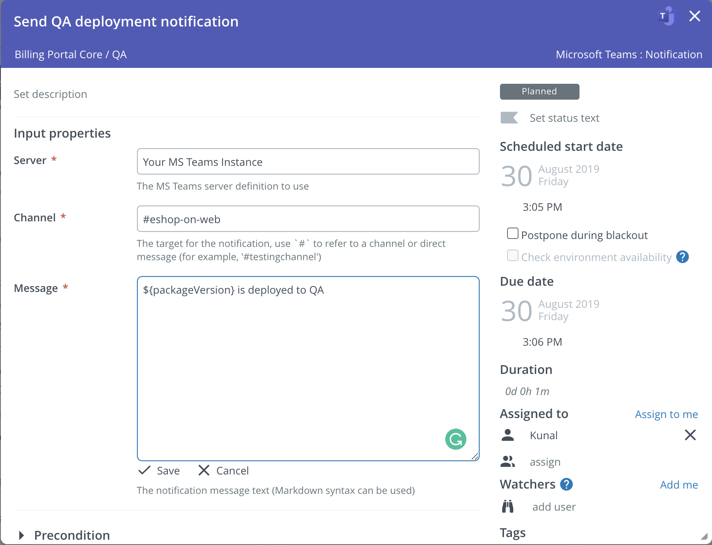
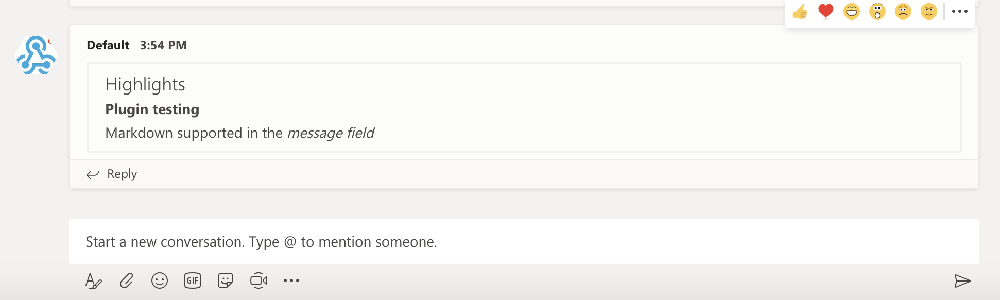

# XL Release Microsoft Teams Plugin


[](https://www.codacy.com/app/AkshatParmar/xlr-teams-plugin?utm_source=github.com&amp;utm_medium=referral&amp;utm_content=AkshatParmar/xlr-teams-plugin&amp;utm_campaign=Badge_Grade)
[](https://codeclimate.com/github/AkshatParmar/xlr-teams-plugin/maintainability)

## Preface
This document describes the functionality provided by the 'xlr-msteams-plugin'

## Overview
This plugin provides a notification task to send *Teams* messages to channels or direct messages.
Based of Incoming Webhooks integration connector, which provides a URL within an authorization token to **POST** messages using a **JSON** payload.
Check out [Teams Incoming Webhooks](https://docs.microsoft.com/en-us/microsoftteams/platform/concepts/connectors/connectors-using) documentation for background information on how to add Connectors to post messages from external sources into Teams 

## Installation
- Clone the repository and run ```./gradlew build``` to build the JAR file.
- Copy the plugin JAR fole into the *'SERVER_HOME/plugins'* directory of XL Release.

## Configuration
This configuration allows you to connect to a server.
Before setting up a notification task it is **required** to setup an MSTeams server defintion within the following information:
- **Title:** Name of the Teams server defintion.
- **Teams URL:** Tokenized URL provided by the Incoming Webhook integration connector for the specific channel.
- **User name:** OPTIONAL Name to use in notifications.
- **User icon:** OPTIONAL Icon to use in notifcations, should be an emoji, e.g ':100:'



## Available Tasks
The available tasks for interfacing with Teams. These utilize the [Microsoft Teams API](https://docs.microsoft.com/en-us/graph/teams-concept-overview) and the provided Teams Connector Authentication Configuration.

### Notification
The MSTeams notification task needs the next information:

- **Server:** The Teams server definition to use. (the shared configuration)
- **Channel:** The target for the notification, use `#` to refer to a channel or direct message.
- **Message:** The notification message text, it could be [markdown](https://docs.microsoft.com/en-us/outlook/actionable-messages/message-card-reference)



### Notification Task Status
This task uses a release ID, phase title, and task title to identify a single task.  The notification task will run until the specified task reaches a conclusive status (failed, completed, aborted,...), watching the specified task along the way.  A standard use case would be putting any task of interest in a parallel group with this task, and having the notification task watch the other task in the parallel group.  In this case, the `${release.id}` variable would be used in the Release ID field, and the phase and task titles would match the task of interest.

## Example Notification



## References
* [Microsoft Graph Rest API](https://docs.microsoft.com/en-us/graph/api/resources/teams-api-overview?view=graph-rest-1.0)
